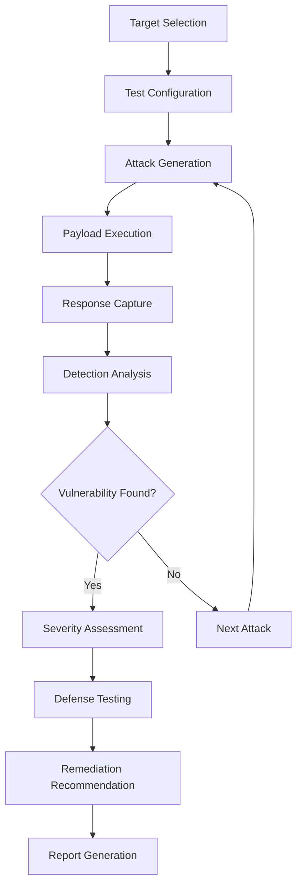

# Prompt Injector Architecture Guide

This document describes the technical architecture of Prompt Injector, from the current MVP to the planned enterprise platform.

## 🏗️ System Overview

Prompt Injector is designed as a desktop-first application with local execution capabilities, ensuring data privacy and security for enterprise environments.

```
┌─────────────────────────────────────────────────────────────────┐
│                      Prompt Injector Desktop                    │
├─────────────────────────────────────────────────────────────────┤
│                          UI Layer (Electron + React)             │
├─────────────────────────────────────────────────────────────────┤
│                         Core Engine (Node.js)                    │
├──────────────┬──────────────┬──────────────┬───────────────────┤
│   Attack     │   Detection  │   Defense    │    Reporting     │
│   Engine     │   Engine     │   Engine     │    Engine        │
├──────────────┴──────────────┴──────────────┴───────────────────┤
│                    Local Storage (SQLite + Files)               │
└─────────────────────────────────────────────────────────────────┘
```

## 🧩 Core Components

### 1. Attack Engine

Generates and executes prompt injection attacks using multiple strategies:

#### Direct Injection Module
- **Role confusion attacks**: Attempts to make the AI forget its role
- **Instruction override attempts**: Tries to override system instructions
- **Jailbreak templates**: Based on research papers and real-world attacks

#### Indirect Injection Module
- **External document poisoning**: Attacks through external data sources
- **API response manipulation**: Manipulates API responses
- **Multi-stage attack chains**: Complex attack sequences

#### Fuzzing Core
- **Mutation-based fuzzing**: Uses grammar rules for attack generation
- **Genetic algorithm**: Evolves attacks based on success rates
- **Unicode and encoding variations**: Tests different encoding methods
- **Context window overflow tests**: Tests token limit boundaries

### 2. Detection Engine

Identifies successful attacks through multiple methods:

#### Response Analysis
- **Semantic similarity**: Compares responses to malicious goals
- **Policy violation detection**: Identifies policy breaches
- **Unexpected behavior patterns**: Detects anomalous responses

#### Meta-Model Validation
- **Secondary LLM judges**: Uses other models to evaluate outputs
- **Cross-validation**: Multiple safety classifiers
- **Behavioral monitoring**: Tracks tool calls and data access

### 3. Defense Engine

Implements and tests various defense mechanisms:

#### SecAlign Implementation
- **Preference optimization**: Aligns model preferences
- **Safety-aligned fine-tuning**: Custom model training
- **Dynamic defense adjustment**: Adaptive security measures

#### Spotlighting System
- **Delimiter-based isolation**: Separates user input from system prompts
- **Encoding strategies**: Various encoding methods
- **Context separation**: Isolates different contexts

### 4. Reporting Engine

Generates comprehensive security assessments:

#### Vulnerability Reports
- **CVSS scoring adaptation**: Adapted for LLM vulnerabilities
- **Attack success rates**: Statistical analysis
- **Remediation priorities**: Prioritized fixes

#### Compliance Mapping
- **OWASP LLM Top 10**: Coverage tracking
- **EU AI Act requirements**: Regulatory compliance
- **NIST AI RMF alignment**: Risk management framework

## 🔄 Data Flow



## 🎯 Key Algorithms

### 1. Adaptive Attack Generation

```typescript
class AdaptiveAttackGenerator {
  private successPatterns: string[] = [];
  private failurePatterns: string[] = [];
  
  generateNextAttack(targetProfile: TargetProfile): AttackPayload {
    // Use genetic algorithm to evolve attacks
    const population = this.initializePopulation();
    
    for (let generation = 0; generation < MAX_GENERATIONS; generation++) {
      // Evaluate fitness based on bypass likelihood
      const fitnessScores = this.evaluateFitness(population);
      
      // Select best performers
      const parents = this.selection(population, fitnessScores);
      
      // Create offspring through crossover and mutation
      const offspring = this.crossoverAndMutate(parents);
      
      population = [...parents, ...offspring];
    }
    
    return this.bestAttack(population);
  }
}
```

### 2. Multi-Stage Attack Orchestration

```typescript
class MultiStageAttacker {
  async executeAttackChain(target: Target): Promise<AttackResult> {
    const stages = [
      this.establishContext,
      this.injectPayload,
      this.triggerExecution,
      this.extractData
    ];
    
    const context: AttackContext = {};
    
    for (const stage of stages) {
      const result = await stage(target, context);
      if (!result.success) {
        break;
      }
      Object.assign(context, result.data);
    }
    
    return new AttackResult(context);
  }
}
```

## 🔌 Integration Points

### CI/CD Integration

```yaml
# GitHub Actions Example
- name: SecurePrompt Security Test
  uses: secureprompt/action@v1
  with:
    config-file: .secureprompt/config.yaml
    fail-on-severity: high
    export-format: sarif
```

### API Integration

```typescript
// REST API for external tools
const secureprompt = new SecurePromptClient({
  endpoint: 'http://localhost:8888',
  apiKey: process.env.SECUREPROMPT_KEY
});

const result = await secureprompt.runTest({
  target: 'https://api.example.com/chat',
  testProfile: 'comprehensive',
  attacks: ['all']
});
```

## 🚀 Performance Optimization

### Parallel Testing
- **Concurrent attack execution**: Multiple attacks run simultaneously
- **Distributed testing**: Tests across multiple targets
- **Result aggregation**: Combines and deduplicates results

### Caching Strategy
- **Attack pattern caching**: Stores successful attack patterns
- **Response fingerprinting**: Identifies similar responses
- **Model response caching**: Caches model responses for efficiency

## 🏗️ Architecture Evolution

### Phase 1: Foundation (Current)
```
Desktop App (Electron + React)
├── Attack Engine (Node.js)
├── Basic UI Components
├── Local Storage (SQLite)
└── Simple API Integration
```

### Phase 2-3: Advanced
```
Desktop App (Electron + React)
├── Advanced Attack Engine
├── ML Detection Stack
├── Agent Framework Support
├── MCP Testing Environment
├── Local + Cloud Storage
└── Multi-API Integration
```

### Phase 4-6: Enterprise
```
Enterprise Platform
├── Cloud Infrastructure
├── Advanced ML Pipeline
├── Research Integration
├── Compliance Engine
├── Enterprise Integrations
└── Global Distribution
```

## 🔧 Technology Stack

### Frontend
- **React 18**: Modern UI framework
- **TypeScript**: Type-safe development
- **Tailwind CSS**: Utility-first styling
- **Electron**: Desktop application framework

### Backend
- **Node.js**: Server-side JavaScript
- **Express**: Web framework
- **SQLite**: Local database
- **Redis**: Caching and session storage

### AI Integration
- **OpenAI API**: GPT models
- **Anthropic API**: Claude models
- **Google Gemini API**: Gemini models
- **Hugging Face**: Open-source models

### Security
- **JWT**: Authentication
- **bcrypt**: Password hashing
- **helmet**: Security headers
- **rate limiting**: API protection

### Development
- **Vite**: Build tool
- **TypeScript**: Type checking
- **ESLint**: Code linting
- **Jest**: Testing framework

## 📊 Performance Metrics

### Response Times
- **Attack Generation**: <5 seconds
- **Model Response**: <15 seconds
- **Detection Analysis**: <3 seconds
- **Report Generation**: <10 seconds

### Scalability
- **Concurrent Tests**: 100+ simultaneous
- **Payload Storage**: 10,000+ payloads
- **User Sessions**: 1,000+ concurrent
- **Data Processing**: 1M+ requests/day

### Accuracy
- **Detection Recall**: 98% target
- **False Positives**: <4% target
- **Attack Success**: Measured per payload type
- **Defense Effectiveness**: Measured per defense type

## 🔒 Security Architecture

### Data Protection
- **Local Storage**: Sensitive data stays local
- **Encryption**: AES-256 for stored data
- **Secure Communication**: TLS 1.3 for API calls
- **Access Control**: Role-based permissions

### Attack Simulation
- **Isolated Environment**: Sandboxed execution
- **Rate Limiting**: Prevents abuse
- **Audit Logging**: Complete activity tracking
- **Vulnerability Reporting**: Secure disclosure process

## 🧪 Testing Strategy

### Unit Testing
- **Attack Payloads**: Individual payload testing
- **Detection Algorithms**: ML model testing
- **API Integration**: External service testing
- **UI Components**: Component-level testing

### Integration Testing
- **End-to-End**: Complete workflow testing
- **Performance**: Load and stress testing
- **Security**: Penetration testing
- **Compatibility**: Cross-platform testing

### Benchmark Testing
- **INJECAGENT**: Prompt injection benchmark
- **AgentDojo**: Agent-based system testing
- **AdvBench**: Universal attack testing
- **Custom Benchmarks**: Organization-specific tests

## 📈 Monitoring & Observability

### Metrics Collection
- **Application Metrics**: Response times, error rates
- **Business Metrics**: User activity, feature usage
- **Security Metrics**: Attack success rates, detection accuracy
- **Performance Metrics**: Resource usage, throughput

### Logging Strategy
- **Structured Logging**: JSON format logs
- **Log Levels**: Debug, Info, Warn, Error
- **Log Rotation**: Daily log files
- **Log Analysis**: Automated log processing

### Alerting
- **Error Alerts**: Application errors
- **Performance Alerts**: Slow response times
- **Security Alerts**: Attack detection
- **Business Alerts**: Usage anomalies

## 🔄 Deployment Architecture

### Development Environment
- **Local Development**: Hot reload, debugging
- **Testing Environment**: Automated testing
- **Staging Environment**: Pre-production testing
- **Production Environment**: Live deployment

### Container Strategy
- **Docker**: Application containerization
- **Kubernetes**: Orchestration (future)
- **Service Mesh**: Communication management (future)
- **Load Balancing**: Traffic distribution (future)

## 📚 API Documentation

### Core API Endpoints

#### Attack Management
```typescript
// Create new attack test
POST /api/tests
{
  "name": "System Prompt Extraction",
  "target": "gpt-4",
  "payloads": ["llm01-role-confusion"],
  "config": { ... }
}

// Get test results
GET /api/tests/:id/results
{
  "testId": "test-123",
  "status": "completed",
  "results": [ ... ]
}
```

#### Detection API
```typescript
// Analyze response for attacks
POST /api/detect
{
  "response": "AI response text",
  "context": { ... },
  "model": "gpt-4"
}

// Get detection results
{
  "attackDetected": true,
  "confidence": 0.95,
  "attackType": "llm01-role-confusion",
  "severity": "HIGH"
}
```

## 🤝 Contributing to Architecture

### Design Principles
1. **Modularity**: Loose coupling between components
2. **Extensibility**: Easy to add new features
3. **Security**: Security by design
4. **Performance**: Optimized for speed
5. **Usability**: Intuitive user experience

### Architecture Decisions
- **Desktop First**: Privacy and security focus
- **TypeScript**: Type safety and developer experience
- **Electron**: Cross-platform desktop deployment
- **SQLite**: Simple local storage
- **Modular Services**: Easy testing and maintenance

### Future Considerations
- **Cloud Migration**: Enterprise deployment
- **Microservices**: Scalable architecture
- **Event-Driven**: Real-time processing
- **ML Pipeline**: Advanced AI capabilities

---

*This architecture guide is a living document that will be updated as the system evolves. We welcome feedback and suggestions from the community!* 