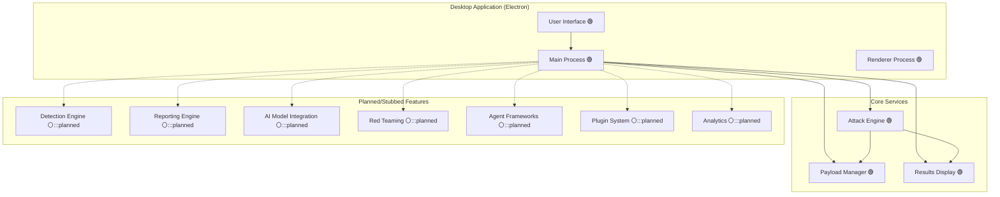
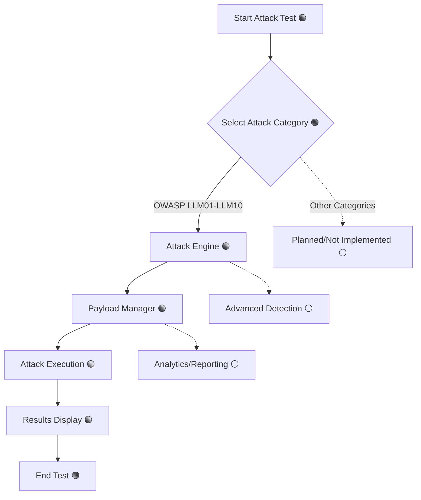
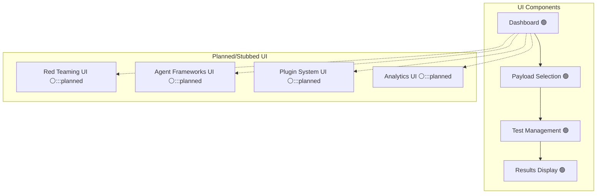
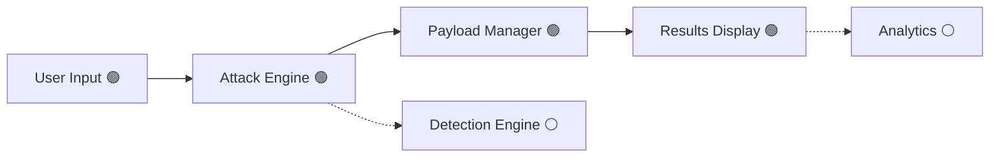
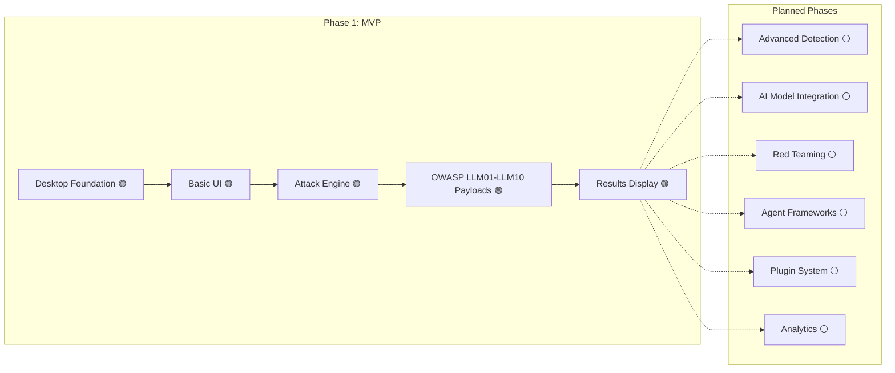

# Prompt Injector - Application Architecture Diagrams

> **Legend:**
> - **Solid border**: Fully implemented (MVP)
> - **Dashed border**: UI-only/Simulated/Stubbed
> - **Gray fill**: Planned/Not implemented
> - **🟢**: MVP/Active
> - **⚪️**: Planned only

---

## 1. MVP System Architecture

---

## 2. MVP Attack Testing Pipeline

---

## 3. MVP UI Overview

---

## 4. MVP Data Flow

---

## 5. MVP Development Workflow

---

## Key Features Summary (MVP)

### Core Capabilities
- **Prompt Injection Attack Testing**: OWASP LLM01-LLM10 only (implemented)
- **Basic Desktop UI**: Electron + React (implemented)
- **Payload Management**: Select, run, and view results for core payloads (implemented)

### Planned/Not Yet Implemented
- AI model integration (OpenAI, Anthropic, Google, etc.)
- Advanced detection (ML, vector DB, Semantic Guardian)
- Red team campaign orchestration
- Agent framework support
- MCP testing
- Adaptive payloads (ML-driven)
- Plugin system
- Advanced analytics and reporting
- Community features

> **Note:** All diagrams above reflect the MVP scope. Planned features are shown as gray or dashed for future development. 