# Prompt Injector - Technical Architecture & System Diagrams

> **Architecture Overview:**
> This document provides comprehensive technical diagrams and architectural details for the Prompt Injector AI security testing platform. It covers system architecture, data flow, component interactions, and implementation patterns for both current and planned features.

---

## 📋 Table of Contents

1. [System Architecture Overview](#system-architecture-overview)
2. [Application Architecture](#application-architecture)
3. [Data Flow Diagrams](#data-flow-diagrams)
4. [Component Architecture](#component-architecture)
5. [Attack Engine Architecture](#attack-engine-architecture)
6. [AI Model Integration](#ai-model-integration)
7. [Security Architecture](#security-architecture)
8. [Development Architecture](#development-architecture)
9. [Deployment Architecture](#deployment-architecture)
10. [Future Architecture](#future-architecture)

---

## System Architecture Overview

### High-Level System Architecture

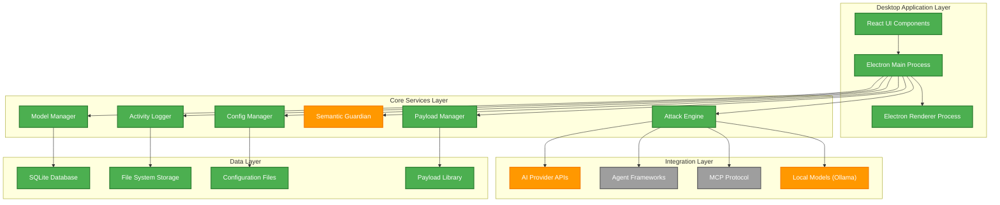

### Technology Stack Architecture

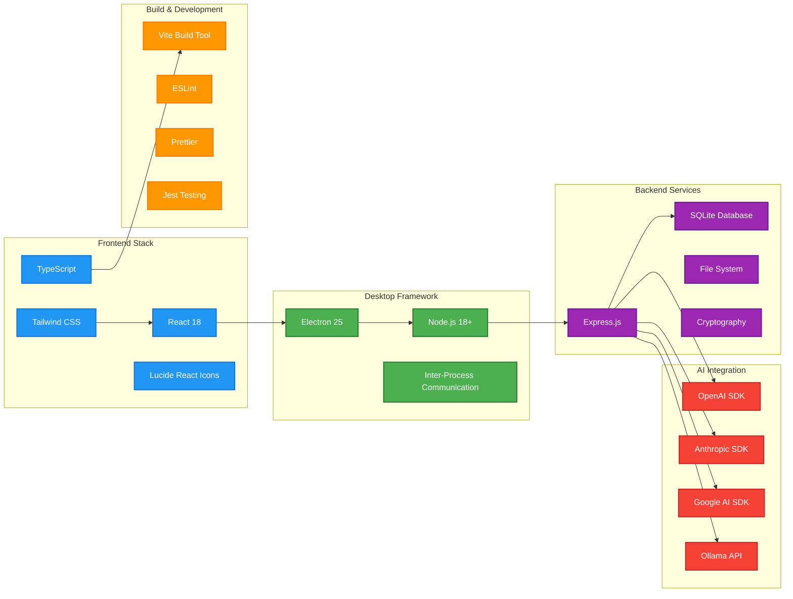

## Application Architecture

### Electron Architecture Pattern

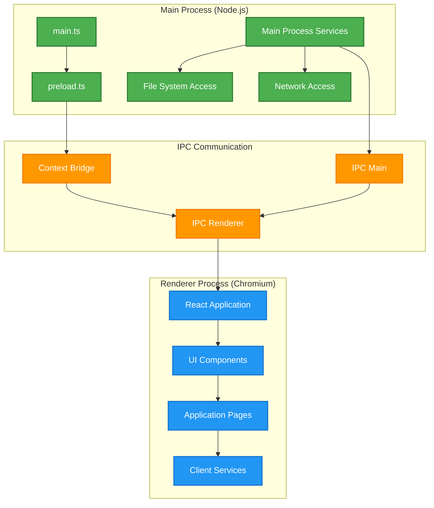

### Component Architecture

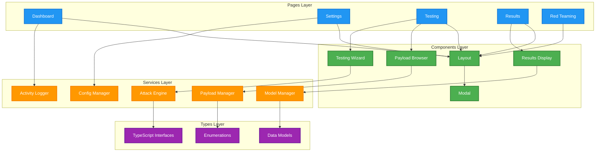

## Data Flow Diagrams

### Attack Testing Data Flow

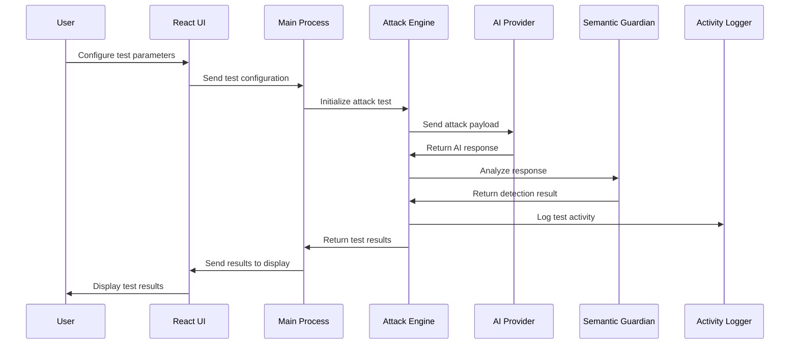

### Model Configuration Data Flow

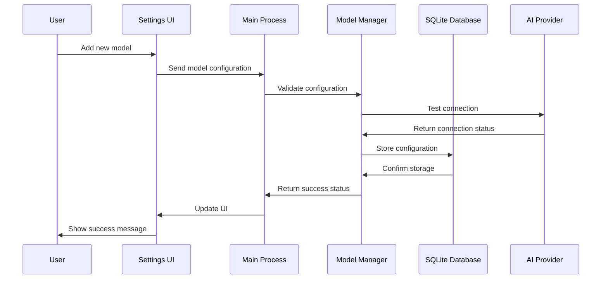

### Payload Management Data Flow

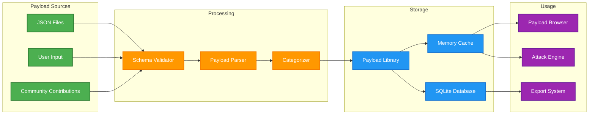

## Component Architecture

### Attack Engine Architecture

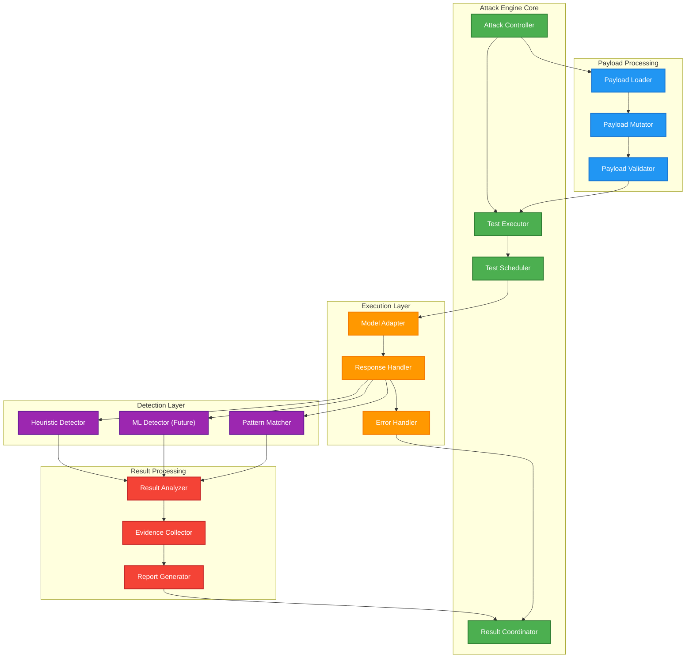

### Model Manager Architecture

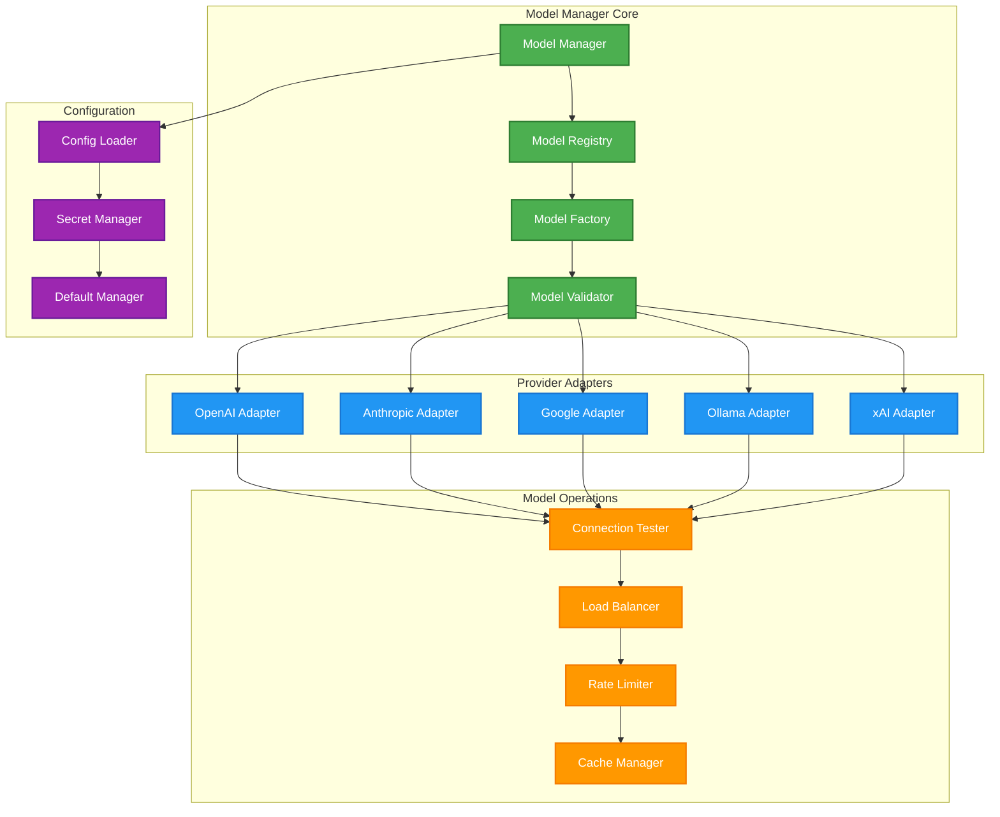

## AI Model Integration

### AI Provider Integration Architecture

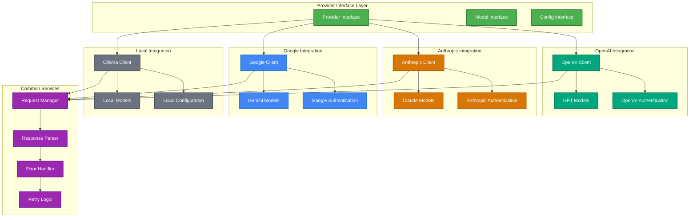

### Agent Framework Integration (Planned)

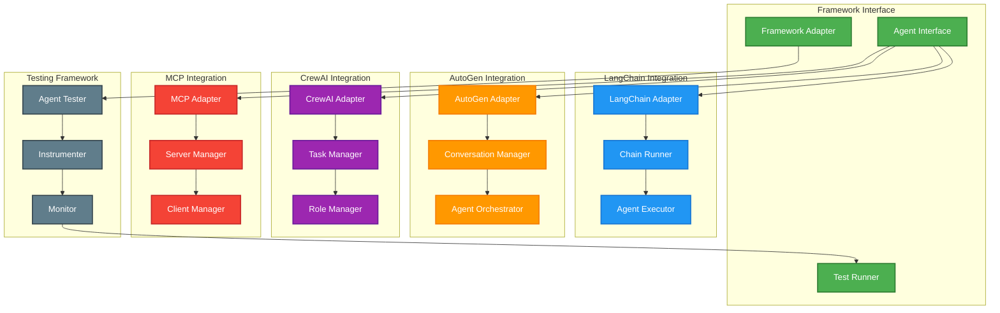

## Security Architecture

### Security Model

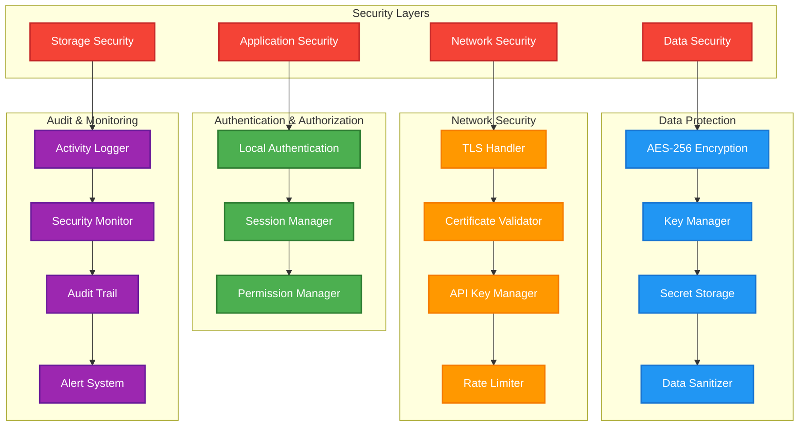

### Threat Model

```mermaid
graph TB
    subgraph "Threat Categories"
        InputThreats["Input Threats"]
        NetworkThreats["Network Threats"]
        DataThreats["Data Threats"]
        SystemThreats["System Threats"]
    end

    subgraph "Input Threats"
        PayloadInjection["Payload Injection"]
        ScriptInjection["Script Injection"]
        CommandInjection["Command Injection"]
    end

    subgraph "Network Threats"
        MITM["Man-in-the-Middle"]
        APIAbuse["API Abuse"]
        DataExfiltration["Data Exfiltration"]
    end

    subgraph "Data Threats"
        DataCorruption["Data Corruption"]
        UnauthorizedAccess["Unauthorized Access"]
        DataLeakage["Data Leakage"]
    end

    subgraph "System Threats"
        PrivilegeEscalation["Privilege Escalation"]
        CodeExecution["Code Execution"]
        SystemCompromise["System Compromise"]
    end

    subgraph "Mitigations"
        InputValidation["Input Validation"]
        TLSEncryption["TLS Encryption"]
        DataEncryption["Data Encryption"]
        SandboxIsolation["Sandbox Isolation"]
    end

    InputThreats --> PayloadInjection
    InputThreats --> ScriptInjection
    InputThreats --> CommandInjection

    NetworkThreats --> MITM
    NetworkThreats --> APIAbuse
    NetworkThreats --> DataExfiltration

    DataThreats --> DataCorruption
    DataThreats --> UnauthorizedAccess
    DataThreats --> DataLeakage

    SystemThreats --> PrivilegeEscalation
    SystemThreats --> CodeExecution
    SystemThreats --> SystemCompromise

    PayloadInjection --> InputValidation
    ScriptInjection --> InputValidation
    CommandInjection --> InputValidation
    MITM --> TLSEncryption
    APIAbuse --> TLSEncryption
    DataExfiltration --> TLSEncryption
    DataCorruption --> DataEncryption
    UnauthorizedAccess --> DataEncryption
    DataLeakage --> DataEncryption
    PrivilegeEscalation --> SandboxIsolation
    CodeExecution --> SandboxIsolation
    SystemCompromise --> SandboxIsolation

    classDef threats fill:#F44336,stroke:#C62828,stroke-width:2px,color:#fff
    classDef input fill:#FF5722,stroke:#D84315,stroke-width:2px,color:#fff
    classDef network fill:#FF9800,stroke:#F57C00,stroke-width:2px,color:#fff
    classDef data fill:#2196F3,stroke:#1976D2,stroke-width:2px,color:#fff
    classDef system fill:#9C27B0,stroke:#6A1B9A,stroke-width:2px,color:#fff
    classDef mitigations fill:#4CAF50,stroke:#2E7D32,stroke-width:2px,color:#fff

    class InputThreats,NetworkThreats,DataThreats,SystemThreats threats
    class PayloadInjection,ScriptInjection,CommandInjection input
    class MITM,APIAbuse,DataExfiltration network
    class DataCorruption,UnauthorizedAccess,DataLeakage data
    class PrivilegeEscalation,CodeExecution,SystemCompromise system
    class InputValidation,TLSEncryption,DataEncryption,SandboxIsolation mitigations
```

## Development Architecture

### Development Environment

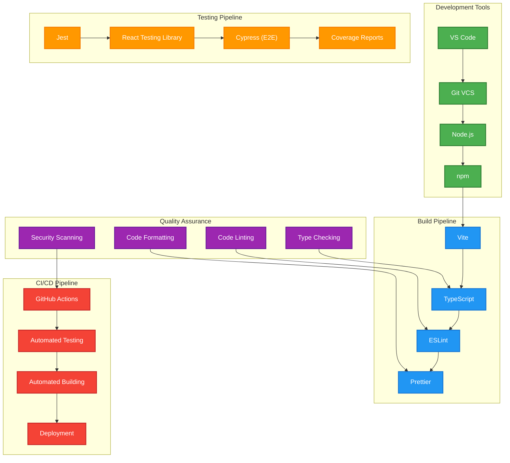

### Code Organization

```mermaid
graph TB
    subgraph "Source Structure"
        src["src/"]
        components["components/"]
        pages["pages/"]
        services["services/"]
        types["types/"]
        main["main/"]
        tests["__tests__/"]
    end

    subgraph "Components"
        Layout["Layout.tsx"]
        Modal["Modal.tsx"]
        PayloadBrowser["PayloadBrowser.tsx"]
        TestingWizard["TestingWizard.tsx"]
    end

    subgraph "Pages"
        Dashboard["Dashboard.tsx"]
        Settings["Settings.tsx"]
        Testing["Testing.tsx"]
        Results["Results.tsx"]
    end

    subgraph "Services"
        AttackEngine["attack-engine.ts"]
        ModelManager["model-manager.ts"]
        PayloadManager["payload-manager.ts"]
        ConfigManager["config-manager.ts"]
    end

    subgraph "Main Process"
        MainTS["main.ts"]
        PreloadTS["preload.ts"]
        MainServices["services/"]
    end

    src --> components
    src --> pages
    src --> services
    src --> types
    src --> main
    src --> tests

    components --> Layout
    components --> Modal
    components --> PayloadBrowser
    components --> TestingWizard

    pages --> Dashboard
    pages --> Settings
    pages --> Testing
    pages --> Results

    services --> AttackEngine
    services --> ModelManager
    services --> PayloadManager
    services --> ConfigManager

    main --> MainTS
    main --> PreloadTS
    main --> MainServices

    classDef structure fill:#4CAF50,stroke:#2E7D32,stroke-width:2px,color:#fff
    classDef components fill:#2196F3,stroke:#1976D2,stroke-width:2px,color:#fff
    classDef pages fill:#FF9800,stroke:#F57C00,stroke-width:2px,color:#fff
    classDef services fill:#9C27B0,stroke:#6A1B9A,stroke-width:2px,color:#fff
    classDef mainprocess fill:#F44336,stroke:#C62828,stroke-width:2px,color:#fff

    class src,components,pages,services,types,main,tests structure
    class Layout,Modal,PayloadBrowser,TestingWizard components
    class Dashboard,Settings,Testing,Results pages
    class AttackEngine,ModelManager,PayloadManager,ConfigManager services
    class MainTS,PreloadTS,MainServices mainprocess
```

## Deployment Architecture

### Build Architecture

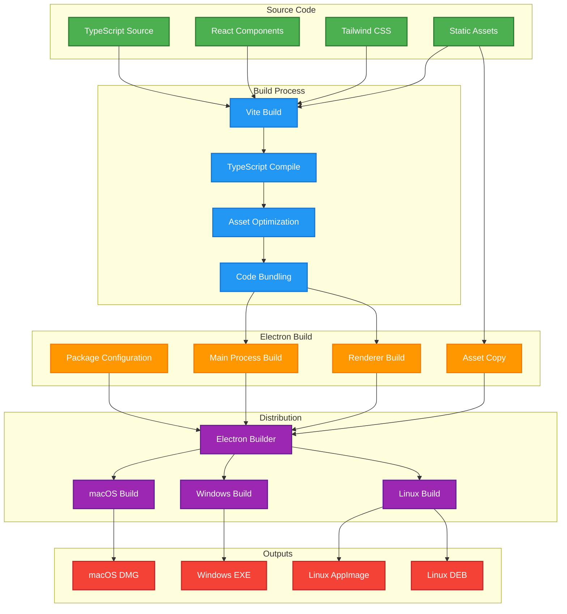

### Distribution Architecture

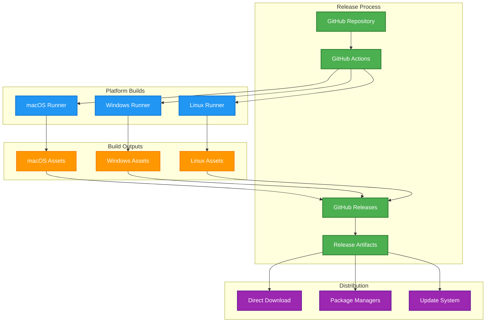

## Future Architecture

### Planned Features Architecture

### Evolution Architecture

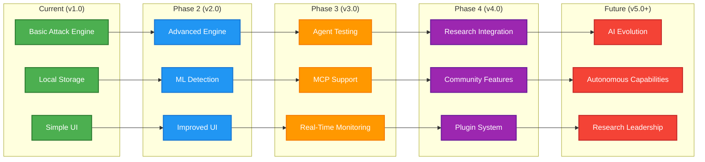

---

## 🎯 Architecture Summary

### Current Implementation Status

| Component | Status | Description |
|-----------|--------|-------------|
| **React UI** | ✅ Complete | Modern, responsive user interface |
| **Electron Framework** | ✅ Complete | Cross-platform desktop application |
| **Attack Engine** | ✅ Complete | Core testing engine with payload support |
| **Model Manager** | ✅ Complete | AI model configuration and management |
| **Payload Manager** | ✅ Complete | Payload library and management system |
| **Local Storage** | ✅ Complete | SQLite database for local data |
| **AI Integration** | 🚧 In Progress | Partial implementation across providers |
| **Semantic Guardian** | 🚧 In Progress | Heuristic detection, ML planned |
| **Agent Frameworks** | 📋 Planned | LangChain, AutoGen, CrewAI integration |
| **MCP Testing** | 📋 Planned | Model Context Protocol support |
| **Plugin System** | 📋 Planned | Community extensibility framework |

### Architecture Principles

1. **🔒 Security First**: All operations are performed locally with strong encryption
2. **🏗️ Modular Design**: Clean separation of concerns and extensible architecture
3. **🚀 Performance**: Optimized for fast response times and efficient resource usage
4. **🌐 Cross-Platform**: Consistent experience across Windows, macOS, and Linux
5. **📈 Scalable**: Architecture supports future growth and feature additions
6. **🔧 Extensible**: Plugin system and community contributions
7. **🎯 User-Centric**: Intuitive interface and excellent user experience

### Key Technical Decisions

- **Electron + React**: Best combination for cross-platform desktop applications
- **TypeScript**: Type safety and better developer experience
- **SQLite**: Reliable local storage without external dependencies
- **Modular Services**: Clean architecture with clear separation of concerns
- **Security by Design**: Local-first approach with comprehensive security measures

---

*This architecture document evolves with the project. For implementation details, refer to the source code and accompanying documentation.*

**Document Version**: 2.0  
**Last Updated**: January 2025  
**Next Review**: March 2025  
**Architecture Status**: Phase 1 Complete, Phase 2 In Progress 